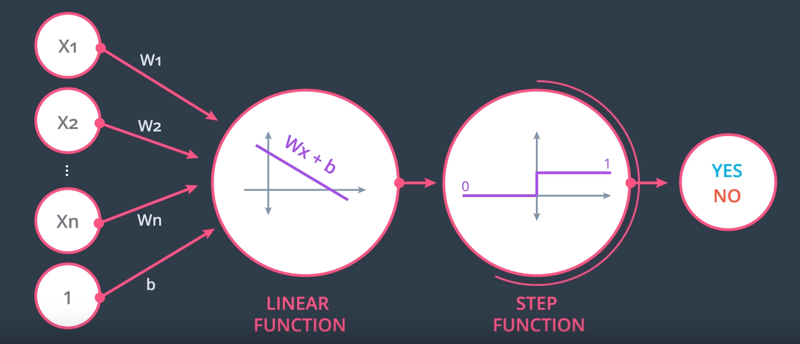

# Introduction to Neural Networks

## What is a NN?

A NN draws a line between red and blue data points.

When a linear model can separate points, it has a formula like:

$ 2x_1 + x_2 + 18 = 0 $

Points where the equation $= 0$ are accepted by convention. $<0$ is rejected.

Generally, a linear equation is:

$Wx + b = 0$

where $W = (w_1, w_2)$ and $x = (x_1, x_2)$

$Y$ are the labels of the given data points.

Each point is of the form (x_1, x_2, Y).

The purpose of the learning algorithm is to find a solution which has $\hat y$ as close as possible to $y$.

In 3D, the boundary will be a plane, in the form:

$Wx + b = 0$

where $W = (w_1, w_2, w_3)$ and $x = (x_1, x_2, x_3)$

with $n$ dimensions, the solution is a $n-1$-dimensional hyperplane.

### Perceptron

The edges from input nodes $(x_1, x_2, …)$ are numbered with the values of $w_1$ and $w_2$, and the perceptron node itself is labelled with the bias term.

The bias could also be an edge label on an input node which is set to the constant $1$.

There is the linear part and the non-linear or activation function (above it's the non-linear step function).

Some logical operations can be represented by perceptrons:

The AND perceptron can be changed to an OR by:
 * Decreasing $b$ (think the $y$-intercept term in $y=mx+b$) moves the line down
 * Since $y= w_1x_1 w_2x_2 + b = 0$, increasing the weights will require decreasing $x_1, x_2$ to keep the equality, which moves the line diagonally toward the origin.

XOR requires a more complex solution because there is no straight line which can correctly separate the blue and red points.

For XOR, we have a neural network of 4 perceptrons: XOR = AND(OR, NOT(AND))

### Automating the decision boundary line equation

We want an algorithm to automatically learn the decision boundary line.

If a particular point is misclassified, we want the decision boundary line to move closer to that point, and eventually past it.

To move the line closer:

* to a false positive, *subtract* the point
* to a false negatie, *add* the point

Use 1 as the value for the bias.

To dampen the movement, multiply by a learning rate.

https://classroom.udacity.com/nanodegrees/nd188/parts/ef29955b-1133-473a-a46f-c0696c865f97/modules/f9c54fe1-528c-48ea-a29b-2917af192032/lessons/8a041692-b23c-4443-b3a5-ba5d2f840db7/concepts/4d015fb7-e73c-447f-a17a-34a0a2b694a0#

The answer to:
Quiz: Build an XOR Multi-Layer Perceptron

has a different network structure to the question.

