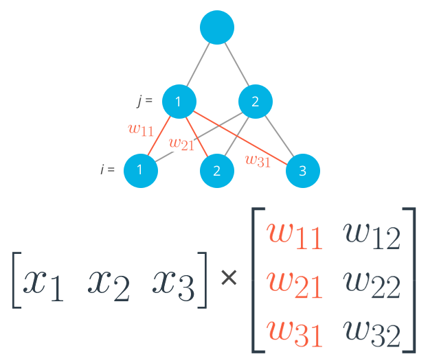
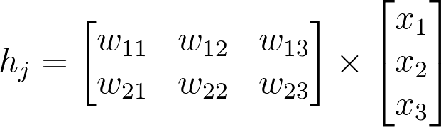

# Lesson 2

Sum of Squared Errors (SSE) ensures positive error and penalises larger errors:


Where:
*  are the datapoints
*  are the output neurons

For intuition, consider a single layer network:


Where  is the activation funciton and the s represent input nodes to the layer we are considering. The sum over  is because a node's activation is the weighted sum of all input nodes.
The bias term has a weight of .

Substituting into the previous formula, we see that the error depends solely on the weights:


So the weights are the knobs that we turn to adjust the overall error (the inputs  are fixed).


We use the Mean Squared Error (MSE) instead of the SSE to prevent the error being (approx) proportional to the number of datapoints, and needing to scale the learning rate.


## Gradient Descent

Algorithm for updating the weights with batch gradient descent:

1. Set the weight step to zero: 
1. For each record in the training data:
  * Make a forward pass through the network, calculating the output 
  * Calculate the error term for the output unit, 
  * Update the weight step 
1. Update the weights 

   where $\eta$ is the learning rate and mm is the number of records. Here we're averaging the weight steps to help reduce any large variations in the training data.
1. Repeat for  epochs.

## Initialising weights

Initialise weights from a normal distribution with  =  and  where  is the number of input units. This keeps the input to the sigmoid low for increasing numbers of input units.

## Gradient Descent (without bias term)

```
   import numpy as np
from data_prep import features, targets, features_test, targets_test


def sigmoid(x):
    """
    Calculate sigmoid
    """
    return 1 / (1 + np.exp(-x))

# TODO: We haven't provided the sigmoid_prime function like we did in
#       the previous lesson to encourage you to come up with a more
#       efficient solution. If you need a hint, check out the comments
#       in solution.py from the previous lecture.

# Use to same seed to make debugging easier
np.random.seed(42)

n_records, n_features = features.shape
last_loss = None

# Initialize weights
weights = np.random.normal(scale=1 / n_features**.5, size=n_features)

# Neural Network hyperparameters
epochs = 1000
learnrate = 0.5

for e in range(epochs):
    del_w = np.zeros(weights.shape)
    for x, y in zip(features.values, targets):
        # Loop through all records, x is the input, y is the target

        # Activation of the output unit
        #   Notice we multiply the inputs and the weights here
        #   rather than storing h as a separate variable
        output = sigmoid(np.dot(x, weights))

        # The error, the target minus the network output
        error = y - output

        # The error term
        #   Notice we calulate f'(h) here instead of defining a separate
        #   sigmoid_prime function. This just makes it faster because we
        #   can re-use the result of the sigmoid function stored in
        #   the output variable
        error_term = error * output * (1 - output)

        # The gradient descent step, the error times the gradient times the inputs
        del_w += error_term * x

    # Update the weights here. The learning rate times the
    # change in weights, divided by the number of records to average
    weights += learnrate * del_w / n_records

    # Printing out the mean square error on the training set
    if e % (epochs / 10) == 0:
        out = sigmoid(np.dot(features, weights))
        loss = np.mean((out - targets) ** 2)
        if last_loss and last_loss < loss:
            print("Train loss: ", loss, "  WARNING - Loss Increasing")
        else:
            print("Train loss: ", loss)
        last_loss = loss


# Calculate accuracy on test data
tes_out = sigmoid(np.dot(features_test, weights))
predictions = tes_out > 0.5
accuracy = np.mean(predictions == targets_test)
print("Prediction accuracy: {:.3f}".format(accuracy))
```

## Weights matrix representation

Each *row* in the matrix will correspond to the weights leading *out* of a single input unit, and each *column* will correspond to the weights leading *in* to a single hidden unit.



However, I prefer to use:



Numpy converts lists and tuples to row vectors, with an unspecified 2nd dimension:

```
>>> a = np.array([1, 2, 3])
>>> a
array([1, 2, 3])
>>> a.shape
(3,)
```

Even transposing still returns a row vector:
```
>>> a.T
array([1, 2, 3])
>>> a.T.T
array([1, 2, 3])
```

To get a column vector, use `a[:, None]` (Note that `-1` does *not* work in place of `None`):
```
>>> a[:, None]
array([[1],
       [2],
       [3]])

>>> a = np.array([1, 2, 3])[:, np.newaxis]
>>> a
array([[1],
       [2],
       [3]])
```

Alternatively:

```
>>> np.array([1, 2, 3], ndmin=2).T
array([[1],
       [2],
       [3]])

>>> a=np.array([[1, 2, 3]]).T
>>> a
array([[1],
       [2],
       [3]])
```

## Gradient descent formulae


  ` # Undo effect of summing each training example's gradient`

Where  is the negative gradient times learning rate.


### Vanishing gradients

Because we multiply by the derivative of the activation function, using sigmoid will mean that the gradient reduces to a **maximum** of 25% of the following layer's gradient.

### Backprop example code

Simple example: only one training set recored, forward and backward pass:

```
import numpy as np


def sigmoid(x):
    """
    Calculate sigmoid
    """
    return 1 / (1 + np.exp(-x))


x = np.array([0.5, 0.1, -0.2])
target = 0.6
learnrate = 0.5

weights_input_hidden = np.array([[0.5, -0.6],
                                 [0.1, -0.2],
                                 [0.1, 0.7]])

weights_hidden_output = np.array([0.1, -0.3])

## Forward pass
hidden_layer_input = np.dot(x, weights_input_hidden)
hidden_layer_output = sigmoid(hidden_layer_input)

output_layer_in = np.dot(hidden_layer_output, weights_hidden_output)
output = sigmoid(output_layer_in)

## Backwards pass
## TODO: Calculate output error
error = target - output

# TODO: Calculate error term for output layer
output_error_term = error * output * (1 - output)

# TODO: Calculate error term for hidden layer

# OET shape is ()    # scalar
# WHO shape is (2,)  # defined above
hidden_error_term = np.dot(output_error_term, weights_hidden_output) * \
                    hidden_layer_output * (1 - hidden_layer_output)

# HET shape is (2,)

# TODO: Calculate change in weights for hidden layer to output layer
delta_w_h_o = learnrate * output_error_term * hidden_layer_output

# TODO: Calculate change in weights for input layer to hidden layer
delta_w_i_h = learnrate * np.outer(x, hidden_error_term)

print('Change in weights for hidden layer to output layer:')
print(delta_w_h_o)
print('Change in weights for input layer to hidden layer:')
print(delta_w_i_h)

# delta_w_i_h.shape == (3, 2)
```

## Multi-layer backprop

Real-world example with more than one training set record.

Use `np.outer()` to calculate the  matrix from the inputs and the layer's error term:


```
import numpy as np
from data_prep import features, targets, features_test, targets_test

np.random.seed(21)

def sigmoid(x):
    """
    Calculate sigmoid
    """
    return 1 / (1 + np.exp(-x))


# Hyperparameters
n_hidden = 2  # number of hidden units
epochs = 900
learnrate = 0.005

n_records, n_features = features.shape
# features.shape == (360, 6)

last_loss = None
# Initialize weights
weights_input_hidden = np.random.normal(scale=1 / n_features ** .5,
                                        size=(n_features, n_hidden))
weights_hidden_output = np.random.normal(scale=1 / n_features ** .5,
                                         size=n_hidden)

for e in range(epochs):
    del_w_input_hidden = np.zeros(weights_input_hidden.shape)
    del_w_hidden_output = np.zeros(weights_hidden_output.shape)
    for x, y in zip(features.values, targets):
        ## Forward pass ##
        # TODO: Calculate the output
        hidden_input = x.dot(weights_input_hidden)
        hidden_output = sigmoid(hidden_input)
        output = sigmoid(hidden_output.dot(weights_hidden_output))

        ## Backward pass ##
        # TODO: Calculate the network's prediction error
        error = y - output

        # TODO: Calculate error term for the output unit
        output_error_term = error * output * (1 - output)

        ## propagate errors to hidden layer

        # TODO: Calculate the hidden layer's contribution to the error
        hidden_error = np.dot(output_error_term, weights_hidden_output)

        # TODO: Calculate the error term for the hidden layer
        hidden_error_term = hidden_error * hidden_output * (1 - hidden_output)

        # hidden_error_term.shape == (2,)

        del_w_hidden_output += output_error_term * hidden_output
        del_w_input_hidden  += np.outer(x, hidden_error_term)


    # TODO: Update weights  (don't forget to division by n_records or number of samples)
    weights_input_hidden  += learnrate * del_w_input_hidden  / n_records
    weights_hidden_output += learnrate * del_w_hidden_output / n_records

    # Printing out the mean square error on the training set
    if e % (epochs / 10) == 0:
        hidden_output = sigmoid(np.dot(x, weights_input_hidden))
        out = sigmoid(np.dot(hidden_output,
                             weights_hidden_output))
        loss = np.mean((out - targets) ** 2)

        if last_loss and last_loss < loss:
            print("Train loss: ", loss, "  WARNING - Loss Increasing")
        else:
            print("Train loss: ", loss)
        last_loss = loss

# Calculate accuracy on test data
hidden = sigmoid(np.dot(features_test, weights_input_hidden))
out = sigmoid(np.dot(hidden, weights_hidden_output))
predictions = out > 0.5
accuracy = np.mean(predictions == targets_test)
print("Prediction accuracy: {:.3f}".format(accuracy))
```

## fdsfas
fdsaf

