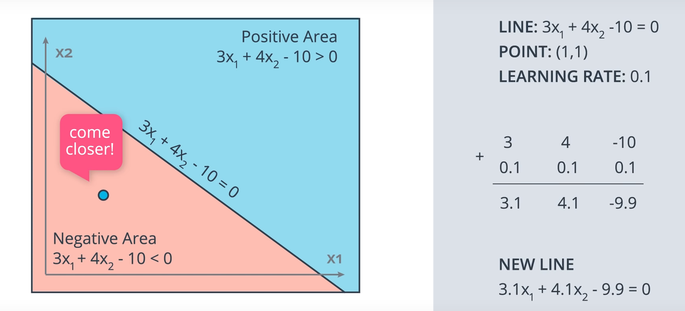
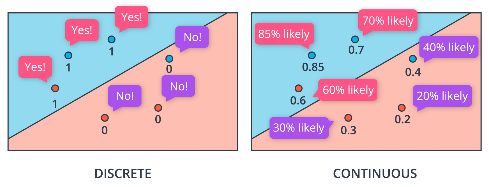
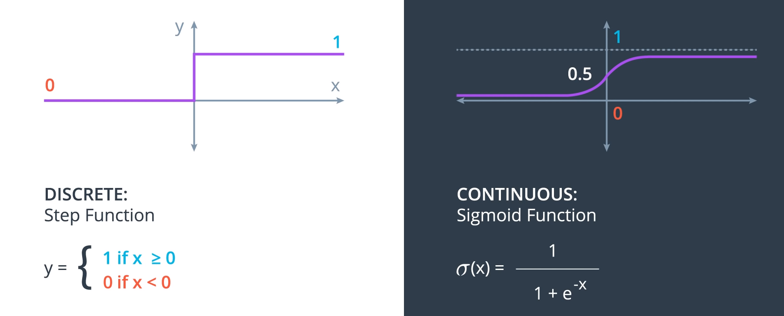
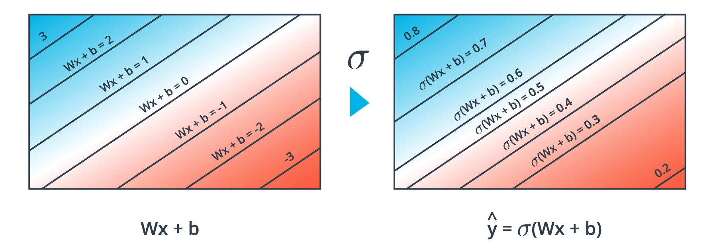

# Introduction to Neural Networks

## What is a NN?

A NN draws a line between red and blue data points.

When a linear model can separate points, it has a formula like:

$ 2x_1 + x_2 + 18 = 0 $

Points where the equation $= 0$ are accepted by convention. $<0$ is rejected.

Generally, a linear equation is:

$Wx + b = 0$

where $W = (w_1, w_2)$ and $x = (x_1, x_2)$

$Y$ are the labels of the given data points.

Each point is of the form $(x_1, x_2, y)$.

The purpose of the learning algorithm is to find a solution which has $\hat y$ as close as possible to $y$.

In 3D, the boundary will be a plane, in the form:

$Wx + b = 0$

where $W = (w_1, w_2, w_3)$ and $x = (x_1, x_2, x_3)$

with $n$ dimensions, the solution is a $n-1$-dimensional hyperplane.

### Perceptron


The edges from input nodes $(x_1, x_2, …)$ are numbered with the values of $w_1$ and $w_2$, and the perceptron node itself is labelled with the bias term.

The bias could also be an edge label on an input node which is set to the constant $1$.


There is the linear part and the non-linear or activation function (above it's the non-linear step function).

Some logical operations can be represented by perceptrons:


The AND perceptron can be changed to an OR by:
 * Decreasing $b$ (think the $y$-intercept term in $y=mx+b$) moves the line down
 * Since $y= w_1x_1 w_2x_2 + b = 0$, increasing the weights will require decreasing $x_1, x_2$ to keep the equality, which moves the line diagonally toward the origin.

NOT requires only a negative weight (which is applied in the non-0 case). In the 0 case, >= 0 implies true.

XOR requires a more complex solution because there is no straight line which can correctly separate the blue and red points.


For XOR, we have a neural network of 4 perceptrons: XOR = AND(OR, NOT(AND))

### Automating the decision boundary line equation

We want an algorithm to automatically learn the decision boundary line.

If a particular point is misclassified, we want the decision boundary line to move closer to that point, and eventually past it.

To move the line closer:

* to a false positive, *subtract* the point
* to a false negative, *add* the point

Use 1 as the value for the bias.



To dampen the movement, multiply by a learning rate.


### Non-linear regions


Non-linear regions require a more complex solution than a simple straight line (linear equation).

### Error functions

An error function tells us how far we are from the perfect solution. We "move" one step in the direction which reduces the error the most by changing the model's weights.

### Gradient Descent

Gradient descent is taking a step towards the steepest slope down the mountain. Local minima exist, and are talked about later, but still give a pretty good solution.

### Discrete vs Continuous error functions

The error function needs to be continuous so that it can be differentiated, as the derivative gives the slope, and we want to take a step down the steepest slope.

If the error function gave discrete values (eg the count of misclassifcations), it wouldn't be possible to know which direction to move the weights.

So we want the style on the right:





* When the sum is 0, the sigmoid output is $0.5$.
* Large positive numbers give values close to $1$.
* Large negative numbers give values close to $0$.




### Softmax

Softmax is used if there are more than two possible labels.  It ensures that the sum of all probabilities equals 1.

$\displaystyle Softmax = \frac{e^{\text{this score}}}{e^{\text{score1}} + e^{\text{score2}} + …}$

```
def softmax(L):
    expL = np.exp(L)
    return np.divide (expL, expL.sum())
```

The exponential function ensures that all negative inputs map to a positive number.

With 2 classes, the output is the same as the sigmoid function.

### One-hot encoding

One-hot encoding ensures that there are no dependencies between the variables.

Each variable has its own numeric range, a probability between 0 and 1.

Eg, if `(duck, beaver, walrus)` were assigned values of `(1, 2, 3)` then does prediction of `2` mean `beaver` or .5 probability of `duck` and .5 of `walrus`?

It removes any concept that `beaver` is more `walrus`-y than `duck`, or that it is half way between the two.

### Maximum Likelihood - evaluating models

Maximum Likelihood allows for model selection.

We want to pick the model which gives the highest probability to the provided, correct labels.


Multiply the probabilities of the points getting the ground-truth label. The maximum likelihood is denoted: P(all).

(The required assumption for this to be valid is that all points are independent events)

The goal is to maximise P(all).

### Maximising probabilities

So, we want to move our model toward having a higher P(all).

If there were thousands of points, then the product would be very small (all probabilities are $\le 1$).

Also, if any one probability were almost 0, it would bring the whole product down drastically, without knowing which it was.

So we avoid products.

Instead, we use $log$ to turn products into sums as $log(ab) = log(a) + log(b)$.

Since $ln(1) = 0$, we expect that the logarithms of values in the range $[0, 1]$ will be negative.

So to get positive numbers, we take the negative values of $ln(P(y | x))$.

High probabilities will give values close to 0.

The sum of negative logs is called the *cross entropy*.

A bad model will have a high cross entropy.


The arrangement of points on the right is much more likely to happen, and has a low cross-entropy.

[Top right point should be 0.7]

Points with higher $-log(P)$ scores are those which have the worst (least likely) predictions.

We can think of the $-log(P)$ value as the error of each point's classification.

Cross entropy tells us how likely it is that the events recorded occurred based on the probabilities of them happening.


--------------------

Udacity email: tomnott@gmail.com
Course: https://classroom.udacity.com/nanodegrees/nd188

https://classroom.udacity.com/nanodegrees/nd188/parts/ef29955b-1133-473a-a46f-c0696c865f97/modules/f9c54fe1-528c-48ea-a29b-2917af192032/lessons/8a041692-b23c-4443-b3a5-ba5d2f840db7/concepts/4d015fb7-e73c-447f-a17a-34a0a2b694a0#

The answer to:
Quiz: Build an XOR Multi-Layer Perceptron

has a different network structure to the question.


