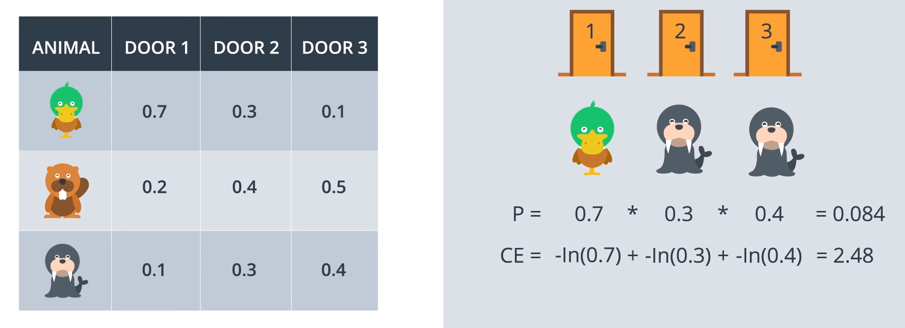
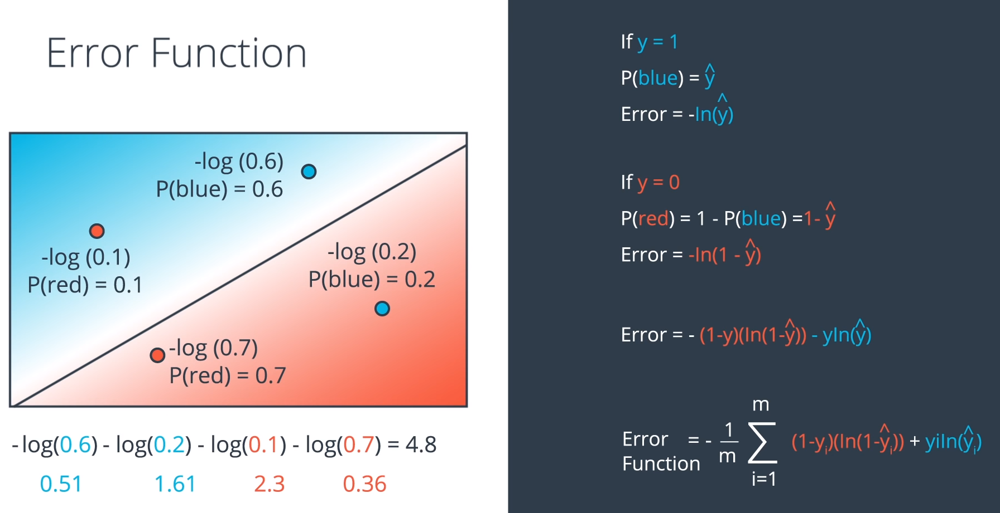
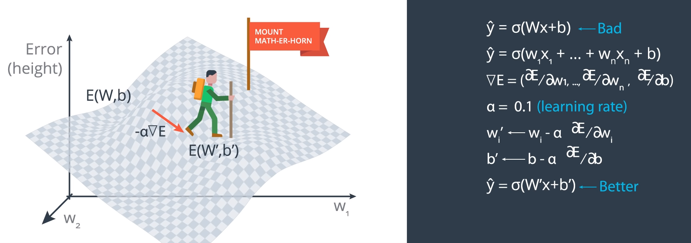
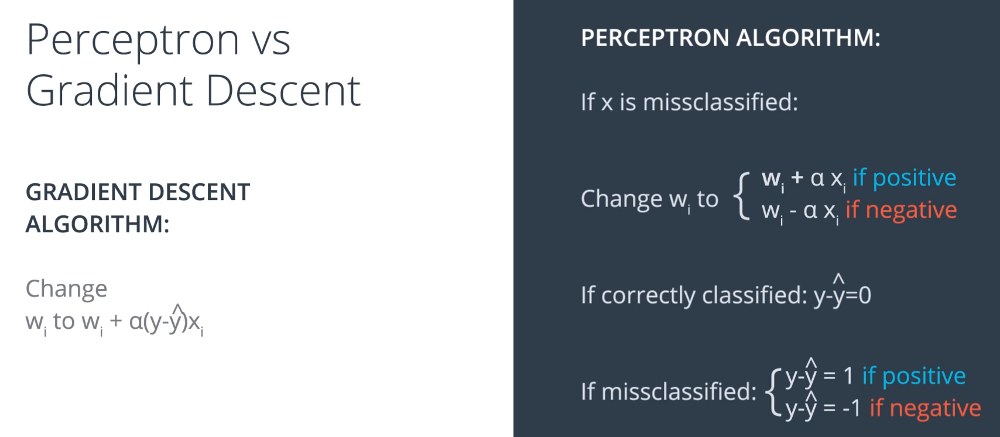
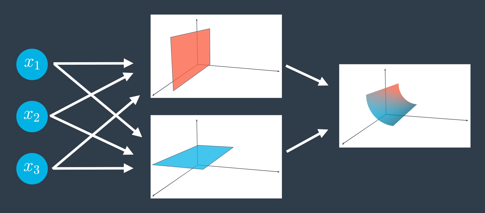
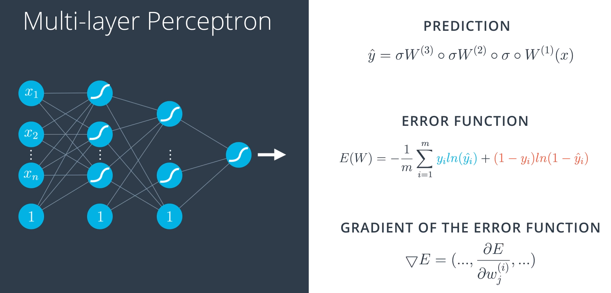
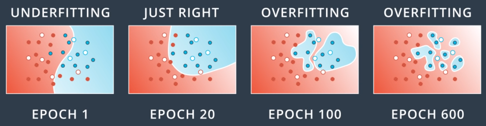
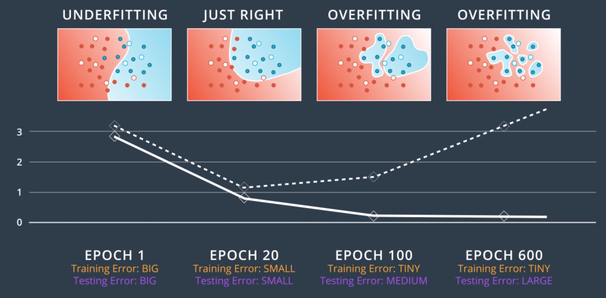
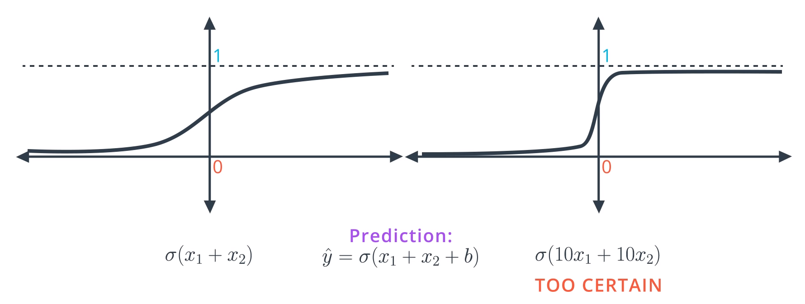

# Introduction to Neural Networks

## What is a NN?

A NN draws a line between red and blue data points.

When a linear model can separate points, it has a formula like:

$ 2x_1 + x_2 + 18 = 0 $

Points where the equation $= 0$ are accepted by convention. $<0$ is rejected.

Generally, a linear equation is:

$Wx + b = 0$

where $W = (w_1, w_2)$ and $x = (x_1, x_2)$

$Y$ are the labels of the given data points.

Each point is of the form $(x_1, x_2, y)$.

The purpose of the learning algorithm is to find a solution which has $\hat y$ as close as possible to $y$.

In 3D, the boundary will be a plane, in the form:

$Wx + b = 0$

where $W = (w_1, w_2, w_3)$ and $x = (x_1, x_2, x_3)$

with $n$ dimensions, the solution is a $n-1$-dimensional hyperplane.

### Perceptron


The edges from input nodes $(x_1, x_2, …)$ are numbered with the values of $w_1$ and $w_2$, and the perceptron node itself is labelled with the bias term.

The bias could also be an edge label on an input node which is set to the constant $1$.


There is the linear part and the non-linear or activation function (above it's the non-linear step function).

Some logical operations can be represented by perceptrons:


The AND perceptron can be changed to an OR by:
 * Decreasing $b$ (think the $y$-intercept term in $y=mx+b$) moves the line down
 * Since $y= w_1x_1 w_2x_2 + b = 0$, increasing the weights will require decreasing $x_1, x_2$ to keep the equality, which moves the line diagonally toward the origin.

NOT requires only a negative weight (which is applied in the non-0 case). In the 0 case, >= 0 implies true.

XOR requires a more complex solution because there is no straight line which can correctly separate the blue and red points.


For XOR, we have a neural network of 4 perceptrons: XOR = AND(OR, NOT(AND))

### Automating the decision boundary line equation

We want an algorithm to automatically learn the decision boundary line.

If a particular point is misclassified, we want the decision boundary line to move closer to that point, and eventually past it.

To move the line closer:

* to a false positive, *subtract* the point
* to a false negative, *add* the point

Use 1 as the value for the bias.


To dampen the movement, multiply by a learning rate.


### Non-linear regions


Non-linear regions require a more complex solution than a simple straight line (linear equation).

### Error functions

An error function tells us how far we are from the perfect solution. We "move" one step in the direction which reduces the error the most by changing the model's weights.

### Gradient Descent

Gradient descent is taking a step towards the steepest slope down the mountain. Local minima exist, and are talked about later, but still give a pretty good solution.

### Discrete vs Continuous error functions

The error function needs to be continuous so that it can be differentiated, as the derivative gives the slope, and we want to take a step down the steepest slope.

If the error function gave discrete values (eg the count of misclassifcations), it wouldn't be possible to know which direction to move the weights.

So we want the style on the right:


* When the sum is 0, the sigmoid output is $0.5$.
* Large positive numbers give values close to $1$.
* Large negative numbers give values close to $0$.


### Softmax

Softmax is used if there are more than two possible labels.  It ensures that the sum of all probabilities equals 1.

$\displaystyle Softmax = \frac{e^{\text{this score}}}{e^{\text{score1}} + e^{\text{score2}} + …}$

```
def softmax(L):
    expL = np.exp(L)
    return np.divide (expL, expL.sum())
```

The exponential function ensures that all negative inputs map to a positive number.

With 2 classes, the output is the same as the sigmoid function.

### One-hot encoding

One-hot encoding ensures that there are no dependencies between the variables.

Each variable has its own numeric range, a probability between 0 and 1.

Eg, if `(duck, beaver, walrus)` were assigned values of `(1, 2, 3)` then does prediction of `2` mean `beaver` or .5 probability of `duck` and .5 of `walrus`?

It removes any concept that `beaver` is more `walrus`-y than `duck`, or that it is half way between the two.

### Maximum Likelihood - evaluating models

Maximum Likelihood allows for model selection.

We want to pick the model which gives the highest probability to the provided, correct labels.


Multiply the probabilities of the points getting the ground-truth label. The maximum likelihood is denoted: P(all).

(The required assumption for this to be valid is that all points are independent events)

The goal is to maximise P(all).

### Maximising probabilities

So, we want to move our model toward having a higher P(all).

If there were thousands of points, then the product would be very small (all probabilities are $\le 1$).

Also, if any one probability were almost 0, it would bring the whole product down drastically, without knowing which it was.

So we avoid products.

Instead, we use $log$ to turn products into sums as $log(ab) = log(a) + log(b)$.

Since $ln(1) = 0$, we expect that the logarithms of values in the range $[0, 1]$ will be negative.

So to get positive numbers, we take the negative values of $ln(P(y | x))$.

High probabilities will give values close to 0.

The sum of negative logs is called the *cross entropy*.

A bad model will have a high cross entropy.


The arrangement of points on the right is much more likely to happen, and has a low cross-entropy.

[LHS has more realistic probability values. RHS top-right point should be 0.7]

Points with higher $-log(P)$ scores are those which have the worst (least likely) predictions.

We can think of the $-log(P)$ value as the error of each point's classification.

Cross entropy tells us how likely it is that the events we observed occurred based on the probabilities of them happening.

The goal has changed: from maximising probability to minimising cross entropy.

Assume 3 doors have different probabilities of having a gift behind them:


The probability of the outcome as recorded by red circles is $0.8 \times 0.7 \times 0.9 = 0.504$


Above the 8 rows are the $2^3$ possible outcomes. The probabilities column sums to $1$.

Note the cross entropy is highest when the probability is lowest.

Cross-entropy is inversely proportional to the total probability of an outcome.


As $y_i$ is either $0$ or $1$, [either the first or second term of the sum is cancelled out](https://stats.stackexchange.com/a/287933/162527).

Note the bottom right notation.

```
def cross_entropy(Y, P):
    Y = np.float_(Y)
    P = np.float_(P)
    return -np.sum(Y * np.log(P) + (1 - Y) * np.log(1 - P))
```

### Multi-class cross entropy

So far, we've looked only at binary outcomes (gift or not).  Here for 3 possible outcomes:




In the bottom right formula, $m$ is the number of classes, $n$ the number of observations.

### Logistic regression cost function



By convention, we multiply by $1 \over m$ to get the average value. (Also done if using the multi-class formula.)

Substituting $y = \sigma(Wx + b)$ we get:


A loss function computes the error for a single training example; the cost function is the average of the loss functions of the entire training set, and may be regularised (see later).

### Gradient descent


The negative derivative tells us the direction of steepest slope to follow down to a lower cost.



The derivative of the cost / error function at a point $x$ with label $y$ an prediction $\hat y$ is:

$ \displaystyle \frac{\delta E}{\delta w_j}=−(y− \hat y )x_j $

$ \displaystyle \frac{\delta E}{\delta b}=−(y− \hat y ) $

$ ∇E=−(y− \hat y )(x_1 ,\ …\ ,x_n,1)$

The $1$ gives the derivative of the bias term.

* The gradient is a scalar times the coordinates of the point.
* The scalar is the difference between the label and prediction.
* The closer to the prediction, the smaller the gradient.

The updates of gradient descent are:

$w_i ′ ← w_i + α(y− \hat y )x_i$

$b′ ← b + α(y− \hat y )$

Note: Since we've taken the average of the errors, the term we are adding should be $\frac{1}{m} \cdot \alpha$ instead of $\alpha$, but as $\alpha$ is a constant, then in order to simplify calculations, we'll just take $\frac{1}{m} \cdot \alpha$ to be our learning rate, and abuse the notation by just calling it $\alpha$.

### Gradient Descent vs Perceptron Algorithm

In a perceptron the labels and predictions are either 1 or 0, then the difference is either 0, 1 or -1. In the 0 case, there is no update.

Hence these two are equivalent:



Except on the left, any value in the range $[0,1]$ is possible.


The "go further away" is because a correct point's classification wants to be closer to 1 if it is already correct.

```
def sigmoid(x):
    return 1 / (1 + np.exp(-x))

def output_formula(features, weights, bias):
    return sigmoid(np.dot(features, weights) + bias)

def error_formula(y, output):
    return - y*np.log(output) - (1 - y) * np.log(1-output)

def update_weights(x, y, weights, bias, learnrate):
    output = output_formula(x, weights, bias)
    d_error = y - output
    weights += learnrate * d_error * x
    bias += learnrate * d_error
    return weights, bias
```
### Non-linear models

Neural networks allow for a complex, non-linear boundary.

To combine two perceptrons regions, add their probability outputs. This will give numbers in a range greater than 1, so use the sigmoid function to reduce the values to the range $[0,1]$.


Weights and biases can also be added:


Thus a neural network uses perceptrons as inputs to perceptrons.




With many input variables, there is a high-dimensional space, which is split with a highly non-linear boundary if there are many hidden layers in the network.

Notation: $W^{(l)}_ij$ is the $l$-th layer matrix of weights from the $i$th input of the previous node to the $j$th neuron.


In the above, we want to reduce the weighting given to the top linear model, as it it causing the output to be incorrect.

Also we want the linear model boundaries to move in the directions shown.




The derivative of the sigmoid function is:

$\sigma' = \sigma(x)(1-\sigma(x))$

### Overfitting and underfitting

Underfitting is using a too-simple solution - it will make too many errors. A.k.a. *error due to bias*.

Overfitting is an over-complex too-specific solution which fits the training data extremely well but will not generalise to the test data. A.k.a. *high variance*.




Because it it near to impossible to get the complexity of architecture just right, we err on the side of an overly complex model and then reduce overfitting.

### Early stopping



Do gradient descent only until the test error starts to rise.

### Regularisation



When classifying only to points, the model on the right with larger coefficients gives a better result as the output values are closer to 0 and 1.

However, the gradients will generally be very close to $0$, except in a very small region.

The LHS model will be more effective for gradient descent.

The RHS model will generate large errors because it is overly confident.


The top formula (absolute values) is called L1 Regularisation.

The one with the squared weights is called L2 Regularisation.

L1 is sparse - has small weights tend to go to zero. If we have too many features, L1 can will set some weights to 0 so that some are unused.

L2 generally gives better results for training models.  It prefers small homogeneous weights.

Given the choice between weights $(0,1)$ and $(0.5, 0.5)$, L2 will prefer the latter since $0^2 + 1^2 = 1$ while $0.5^2 + 0.5^2 = 0.5$ is smaller.

### Dropout

Dropout ensures that there is less specialistion in the neurons. Large weights will dominate the network, meaning the other parts don't really get trained.

Dropout randomly turns off parts of the network ensuring a more even contribution of neurons to the final output.

A hyperparameter is the probability that each node will get dropped.

### Local Minima and Random Restart

Gradient descent can have us stop in a local minima. 

Random Restart starts gradient descent again from another random location, increasing the likelihood that a better minima is found.

### Vanishing Gradient

The sigmoid function's gradient becomes very shallow at small distances from $0$.

The derivatives tell us in which direction to move, and determine the movement amount, so we don't want them to be too small.

Because the chain rule is used to calculate the derivative of a first layer weight, this product of derivatives can get smaller and smaller as a network gets deeper, making our descent steps too small.

Tanh is a scaled sigmoid, giving outputs between [-1, 1], instead of [0, 1] and with a steeper slope, between [0, 1] instead of [0, 0.25].

[Why is tanh almost always better than sigmoid as an activation function?](https://stats.stackexchange.com/q/330559/162527)

ReLU returns $max(x, 0)$.  It can improve training signivicantly without sacrificing much accuracy. The gradient is either 1 or 0.

ReLU or Tanh will give larger derivatives, making the chain rule calculated derivatives less small, giving a faster gradient descent.

If ReLU is used, the final layer will still need to be sigmoid or softmax to get probabilities between 0 and 1.

Keeping the final layer as a ReLU helps build regression models which predict their value (used in RNNs).

### Batch vs Stochastic Gradient Descent

Instead of using all the input data before taking a gradient descent step, we can use a single point or mini-batches of input to speed the iteration process with slightly less accurate steps.

### Learning rate decay

What learning rate to use is a non-trivial research question.

A high learning rate can actually bounce out of a local minima. A too low rate will take too long to converge.

If the model isn't working (error is not decreasing), decrease the learning rate.

An optimisation is to decrease learning rates are the model gets closer to a solution.

### Momentum

Momentum uses inertia to bounce out of a local minima based on the speed that we've built up already going downhill.


With a $\beta$ or momentum hyperparameter between 0 and 1, we can have the last step have a lot of influence on the momentum, and a previous step have less by raising $\beta$ to a power based on the age of the step.
