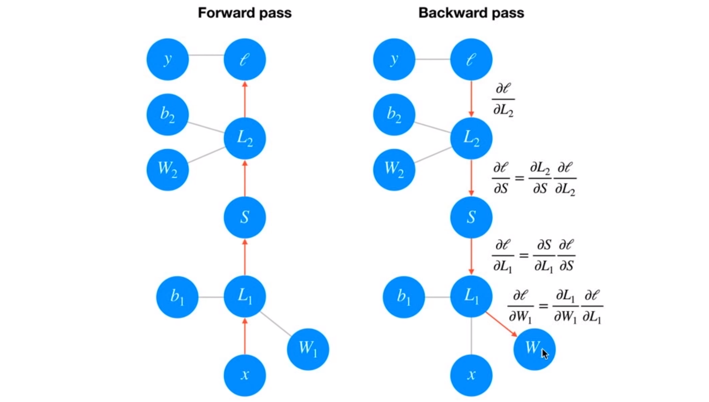

# Lesson 4 - Introduction to PyTorch

## Using Google Colab

To train about 250x faster than on your CPU, use [Google Colab](https://colab.research.google.com/).

Put the following before the first code cell in the notebooks:


```python
#
# Install required modules
#
  !pip install -U pillow  # Get latest pillow if not already installed

  # http://pytorch.org/
  from os.path import exists
  from wheel.pep425tags import get_abbr_impl, get_impl_ver, get_abi_tag
  platform = '{}{}-{}'.format(get_abbr_impl(), get_impl_ver(), get_abi_tag())
  cuda_output = !ldconfig -p|grep cudart.so|sed -e 's/.*\.\([0-9]*\)\.\([0-9]*\)$/cu\1\2/'  # $ due vi syntax
  accelerator = cuda_output[0] if exists('/dev/nvidia0') else 'cpu'

  !pip install -U http://download.pytorch.org/whl/{accelerator}/torch-0.4.1-{platform}-linux_x86_64.whl torchvision
  import torch
```

```python
#
# Check if CUDA is available
#
train_on_gpu = torch.cuda.is_available()

if not train_on_gpu:
    print('CUDA is not available.  Training on CPU ...')
else:
    print('CUDA is available!  Training on GPU ...')
```

## General and Part 1
It is mandatory to inherit from `nn.Module` when you're creating a class for your network.

PyTorch networks created with `nn.Module` must have a `forward` method defined. It takes in a tensor `x` and passes it through the operations you defined in the `__init__` method.

[PyTorch Basic Operations Summary](https://jhui.github.io/2018/02/09/PyTorch-Basic-operations/)

* `*` does element-wise multiplication.
* `@` does matrix multiplication, like A.mm(B). `.matmul` is an alias. `.mm` does not broadcast.

`torch.dot()` treats both objects as 1D vectors (irrespective of their original shape) and computes their inner product.

In-place operators end with a `_`, eg `a.add_(b) == a = a + b`

All operators have an `out` parameter where the result is stored: `torch.add(x, y, out=r1)`

`.numpy()` and `.from_numpy()` convert to/from numpy format. PyTorch uses the same memory layout, and by default the objects are not duplicated.

* `.reshape()` will sometimes return the same memory range, and sometimes a clone
* `.view((<shape>))` to reshape a tensor without changing it. Complains if the shape is invalid.
* `.resize()` can drop or add elements to satisify the given shape.

Set a random seed:

```python
torch.manual_seed(1)
if torch.cuda.is_available:
    torch.cuda.manual_seed_all(1)
```

The default datatype of a tensor is `long`.

This course has the weight matrices arranged transposed compared to Andrew Ng:

$y =  f_2 \! \left(\, f_1 \! \left(\vec{x} \, \mathbf{W_1}\right) \mathbf{W_2} \right)$

Instead of $h=Wx + b$ it is: $\ h=xW +b$

### Part 2 - Neural Networks in Pytorch

Display an image:
```python
import matplotlib.pyplot as plt
plt.imshow(images[1].numpy().squeeze(), cmap='Greys_r');
```
The first argument is expected to be matrix.

Weights: `model.fc1.weight`
Bias: `print(model.fc1.bias)`

```python
# Set biases to all zeros
model.fc1.bias.data.fill_(0)

# Sample from random normal with standard dev = 0.01
model.fc1.weight.data.normal_(std=0.01)
```
## Part 3 - Training Neural Networks

### Gradient Descent



$$
\large \frac{\partial \ell}{\partial W_1} = \frac{\partial L_1}{\partial W_1} \frac{\partial S}{\partial L_1} \frac{\partial L_2}{\partial S} \frac{\partial \ell}{\partial L_2}
$$

**Note:** I'm glossing over a few details here that require some knowledge of vector calculus, but they aren't necessary to understand what's going on.

We update our weights using this gradient with some learning rate $\alpha$.

$$
\large W^\prime_1 = W_1 - \alpha \frac{\partial \ell}{\partial W_1}
$$

The learning rate $\alpha$ is set such that the weight update steps are small enough that the iterative method settles in a minimum.

### Losses in PyTorch

By convention, the loss function is assigned to: `criterion = nn.CrossEntropyLoss`.

The input to criterion functions is expected to be class scores, not probabilities.

[`nn.CrossEntropyLoss`](https://pytorch.org/docs/stable/nn.html#torch.nn.CrossEntropyLoss) criterion combines `nn.LogSoftmax()` and `nn.NLLLoss()` in one single class.

```python
criterion = nn.CrossEntropyLoss()
...
# Calculate the loss with the pre-probability logits and the labels
loss = criterion(logits, labels)
```

It's recommend to use `log_softmax`, `criterion = nn.NLLLoss()`, and get prediction probabilities with `torch.exp(model(input))`.

### Autograd

Autograd works by keeping track of operations performed on tensors, then going backwards through those operations, calculating gradients along the way.

To make sure PyTorch keeps track of operations on a tensor and calculates the gradients, you need to set `requires_grad = True` on a tensor. You can do this at creation with the `requires_grad` keyword, or at any time with `x.requires_grad_(True)`.

You can turn off gradients for a block of code with the `torch.no_grad()` content:
```python
x = torch.zeros(1, requires_grad=True)
>>> with torch.no_grad():
...     y = x * 2
>>> y.requires_grad
False
```

Also, you can turn on or off gradients altogether with `torch.set_grad_enabled(True|False)`.

`.grad` shows a tensor's gradient as calculated by `loss.backward()`

`.grad_fn` shows the function used to calculate `.grad`, eg:
```python
y = x**2
print(y.grad_fn)
```
   Gives: `<PowBackward0 object at 0x7f7ea8231a58>`

## Part 4 - Fashion-MNIST

```python
from torch import nn, optim
import torch.nn.functional as F
```

The network can be defined as a subclass of `nn.Module`:
```python
class Classifier(nn.Module):
    def __init__(self):
        super().__init__()
        self.fc1 = nn.Linear(784, 256)
        self.fc2 = nn.Linear(256, 128)
        self.fc3 = nn.Linear(128, 64)
        self.fc4 = nn.Linear(64, 10)

    def forward(self, x):
        # make sure input tensor is flattened
        x = x.view(x.shape[0], -1)

        x = F.relu(self.fc1(x))
        x = F.relu(self.fc2(x))
        x = F.relu(self.fc3(x))
        x = F.log_softmax(self.fc4(x), dim=1)

        return x
```

Note that `forward()` automatically resizes the images via `view()`.

Alternatively, simple models can be defined via `Sequential`:

```python
model = nn.Sequential(nn.Linear(784, 384),
                      nn.ReLU(),
                      nn.Linear(384, 128),
                      nn.ReLU(),
                      nn.Linear(128, 10),
                      nn.LogSoftmax(dim=1))
```

### Create the network, define the criterion and optimizer
```python
model = Classifier()
criterion = nn.NLLLoss()
optimizer = optim.Adam(model.parameters())
```

### Train a network
```python
epochs = 5

for e in range(epochs):
    running_loss = 0
    for images, labels in trainloader:
        log_ps = model(images)
        loss = criterion(log_ps, labels)

        optimizer.zero_grad()
        loss.backward()
        optimizer.step()

        running_loss += loss.item()
    print(f"Training loss: {running_loss/len(trainloader)}")
```

## Part 5 - Inference and Validation

Making predictions with a NN is called *inference*.

NNs tend to perform too well on their training data (overfitting), and don't generalise to data not seen before.

To test the actual performance, previously unseen data in the *validation set* is used.

We avoid overfitting through regularization such as dropout while monitoring the validation performance during training.

Set `Train=false` to get the test / validation set data:
```python
testset = datasets.FashionMNIST('~/.pytorch/F_MNIST_data/', download=True, train=False, transform=transform)
```

To get a single minibatch from a `DataLoader`:
```python
images, labels = next(iter(testloader))
```

### Get predictions

`top_values, top_indices = ps.topk(k, dim=d)` gives returns the $k$ highest values across dimension $d$.

Since we just want the most likely class, we can use `ps.topk(1)`. If the highest value is the fifth element, we'll get back 4 as the index.

Check if the predictions match the labels:

```python
equals = top_class == labels.view(*top_class.shape)
# equals is a byte tensor of 0 or 1
accuracy = torch.mean(equals.type(torch.FloatTensor))
print(f'Accuracy: {accuracy.item()*100}%')
```

### Dropout

In `__init__()`, add:
    # Dropout module with 0.2 drop probability
    self.dropout = nn.Dropout(p=0.2)

Then, in `forward()`:

    x = self.dropout(F.relu(self.fc1(x)))

Don't use dropout on the output layer.

Turn off dropout during validation, testing, and whenever we're using the network to make predictions.

* `model.eval()` sets the model to evaluation mode where the dropout probability is 0
* `model.train()` turns dropout back on

The presented solution as an inaccuracy in the calculations: it [assumes that the total number of examples is divisible by the minibatch size](https://github.com/udacity/deep-learning-v2-pytorch/issues/71).

Here is my solution which divides by the correct amount (the exact number of training examples):

```python
from torch import nn, optim
import torch.nn.functional as F

class ClassifierDropout(nn.Module):
    def __init__(self):
        super().__init__()

        self.fc1 = nn.Linear(784, 256)
        self.fc2 = nn.Linear(256, 128)
        self.fc3 = nn.Linear(128, 64)
        self.fc4 = nn.Linear(64,  10)

        self.dropout = nn.Dropout(p=0.2)

    def forward(self, x):
        x = x.view(-1, self.fc1.in_features)

        x = self.dropout(F.relu(self.fc1(x)))
        x = self.dropout(F.relu(self.fc2(x)))
        x = self.dropout(F.relu(self.fc3(x)))
        x = F.log_softmax(self.fc4(x), dim=1)

        return x
```

```python
## TODO: Train your model with dropout, and monitor the training progress with the validation loss and accuracy
reseed()
model = ClassifierDropout()
criterion = nn.NLLLoss(reduction='sum')
optimizer = optim.Adam(model.parameters())

epochs = 5
train_losses, test_losses = [], []

for e in range(epochs):
    train_tot_loss = 0
    model.train()  # Ensure training mode

    for images, labels in trainloader:
        optimizer.zero_grad()

        log_ps = model(images)
        loss = criterion(log_ps, labels)
        train_tot_loss += loss.item()
        loss.backward()

        optimizer.step()

    # Evaluate on test set, don't do dropout
    model.eval()

    tot_correct = 0
    test_tot_loss = 0
    with torch.no_grad():
        for images, labels in testloader:
            log_ps = model(images)  # We don't need to torch.exp to get the largest
            test_tot_loss += criterion(log_ps, labels).item()

            top_value, top_index = log_ps.topk(1, dim=1)
            equals = labels == top_index.view(*labels.shape)
            tot_correct += sum(equals).item()

    train_loss = train_tot_loss / len(trainloader.dataset)
    test_loss = test_tot_loss / len(testloader.dataset)

    train_losses.append(train_loss)
    test_losses.append(test_loss)

    print("Epoch {}/{}, ".format(e+1, epochs),
          "Train loss: {:.3f}, ".format(train_loss),
          "Validation loss: {:.3f}, ".format(test_loss),
          "Validation accuracy: {:.3f}".format(tot_correct / len(testloader.dataset)))
```

## Part 6 - Saving and Loading Models

Setup `DataLoader`s:

```python
# Define a transform to normalize the data
transform = transforms.Compose([transforms.ToTensor(),
                                transforms.Normalize((0.5,), (0.5,))])
# Download and load the training data
trainset = datasets.FashionMNIST('~/.pytorch/F_MNIST_data/', download=True, train=True, transform=transform)
trainloader = torch.utils.data.DataLoader(trainset, batch_size=64, shuffle=True)

# Download and load the test data
testset = datasets.FashionMNIST('~/.pytorch/F_MNIST_data/', download=True, train=False, transform=transform)
testloader = torch.utils.data.DataLoader(testset, batch_size=64, shuffle=True)
```

Shortcut for defining and training a network given [`fc_model.py`](fc_model.py):

```python
model = fc_model.Network(784, 10, [512, 256, 128])
criterion = nn.NLLLoss()
optimizer = optim.Adam(model.parameters(), lr=0.001)
```

Train a network:
```python
fc_model.train(model, trainloader, testloader, criterion, optimizer, epochs=2)
```
Note the [output calculations are subtly wrong](https://github.com/udacity/deep-learning-v2-pytorch/issues/71).

`str(model)` gives something like:
```python
 Network(
  (hidden_layers): ModuleList(
    (0): Linear(in_features=784, out_features=512, bias=True)
    (1): Linear(in_features=512, out_features=256, bias=True)
    (2): Linear(in_features=256, out_features=128, bias=True)
  )
  (output): Linear(in_features=128, out_features=10, bias=True)
  (dropout): Dropout(p=0.5)
)
```

`model.state_dict().keys()`:
```python
odict_keys(['hidden_layers.0.weight', 'hidden_layers.0.bias', 'hidden_layers.1.weight', 'hidden_layers.1.bias', 'hidden_layers.2.weight', 'hidden_layers.2.bias', 'output.weight', 'output.bias'])
```

### Saving

The `state_dict` must match the parameters of the model it is being loaded into.

Save every parameter used for building the network in the checkpoint (with the `state_dict`) so that it contains all information to recreate the network.

```python
checkpoint = {'input_size': 784,
              'output_size': 10,
              'hidden_layers': [each.out_features for each in model.hidden_layers],
              'state_dict': model.state_dict()}

torch.save(checkpoint, 'checkpoint.pth')
```

### Loading

```python
def load_checkpoint(filepath):
    checkpoint = torch.load(filepath)
    model = fc_model.Network(checkpoint['input_size'],
                             checkpoint['output_size'],
                             checkpoint['hidden_layers'])
    model.load_state_dict(checkpoint['state_dict'])

    return model
```

```python
model = load_checkpoint('checkpoint.pth')
```

## Part 7 - Loading Image Data

Add the following to download the dataset:
```bash
%%bash
# Only download and unzip data if it hasn't been done already
if [[ ! -d Cat_Dog_data ]]; then
  wget -qc https://s3.amazonaws.com/content.udacity-data.com/nd089/Cat_Dog_data.zip
  unzip Cat_Dog_data.zip | tail -n3;
fi
```

Setup
```python
%matplotlib inline
%config InlineBackend.figure_format = 'retina'

import torch
from torchvision import datasets, transforms
import matplotlib.pyplot as plt
```

### Transpose

For training, all images need to be the same size. Resize them with `transforms.Resize()` or crop with `transforms.CenterCrop()`, `transforms.RandomResizedCrop()`, etc.

At the end, make a `Tensor` with `transforms.ToTensor()`. Transforms can be pipelined with `transforms.Compose()`, eg:

```python
transform = transforms.Compose([transforms.Resize(255),
                                 transforms.CenterCrop(224),
                                 transforms.ToTensor()])

```

Define a pipeline of [`torchvision.transforms`](http://pytorch.org/docs/master/torchvision/transforms.html) like so:

```python
transform = transforms.Compose([transforms.Resize(255),      # Make smallest edge 255px
                                transforms.CenterCrop(224),  # Square image, 224 x 224px
                                transforms.ToTensor()])      # PyTorch-ify
```

The input to the pipeline is expected to be a PIL / Pillow image object.

Data augmentation helps the network generalise to different rotations, crops and scalings. It's a way of simulating a larger dataset to gain better accuracy.

To randomly rotate, scale and crop, then flip your images you would define your transforms like this:

```python
train_transforms = transforms.Compose([transforms.RandomRotation(30),
                                       transforms.RandomResizedCrop(224),
                                       transforms.RandomHorizontalFlip(),
                                       transforms.ToTensor(),
                                       transforms.Normalize([0.5, 0.5, 0.5], 
                                                            [0.5, 0.5, 0.5])])
```

Normalising to 0.5 is done so as to not confuse tutorial readers with "magic numbers". [Soumith says these should really be the RGB means and $\sigma$s calculated over the dataset](https://discuss.pytorch.org/t/normalization-in-the-mnist-example/457/7). The code to do that is [here](https://discuss.pytorch.org/t/normalization-in-the-mnist-example/457/12), which generates the ImageNET magic numbers `[0.485, 0.456, 0.406], [0.229, 0.224, 0.225]` (below).

Normalise with [`transforms.Normalize`](https://pytorch.org/docs/stable/torchvision/transforms.html#torchvision.transforms.Normalize). Pass a list of means and list of standard deviations, then the color channels are normalized like so:

```input[channel] = (input[channel] - mean[channel]) / std[channel]```

Subtracting `mean` centers the data around zero and dividing by `std` squishes the values to be between -1 and 1. Normalizing helps keep the network work weights near zero which in turn makes backpropagation more stable. Without normalization, networks will tend to fail to learn.

When you're testing however, you'll want to use images that aren't altered (except you'll need to normalize the same way).

[For validation/test images, you'll typically just resize and crop.](https://stats.stackexchange.com/a/320967/162527)

### Load data from files into a `Dataset`

Load with [`datasets.ImageFolder`](http://pytorch.org/docs/master/torchvision/datasets.html#imagefolder) from `torchvision`.

```python
dataset = datasets.ImageFolder('path/to/data', transform=transform)
```

### Get mini-batches - `DataLoader`

The classes are directories, and the image names are irrelevant.

A [`DataLoader`](http://pytorch.org/docs/master/data.html#torch.utils.data.DataLoader) takes a `Dataset` (eg from `ImageFolder`) and returns a generator giving batches of images and labels.

```python
dataloader = torch.utils.data.DataLoader(dataset, batch_size=32, shuffle=True)
```

Use the `DataLoader:`
```python
# Looping through it, get a batch on each loop 
for images, labels in dataloader:
    pass

# Get one batch
images, labels = next(iter(dataloader))
```

## Part 8 - Transfer Learning

The first layers of a generic (eg ImageNET) image classifier detect features which can be used to detect different output layers when the final layer(s) of the network are trained to the new, specific task.

The code now looks like this, additionally importing `models`:

```
%matplotlib inline
%config InlineBackend.figure_format = 'retina'

import matplotlib.pyplot as plt

import torch
from torch import nn, optim
import torch.nn.functional as F
from torchvision import datasets, transforms, models
```

```
data_dir = 'Cat_Dog_data'

# TODO: Define transforms for the training data and testing data
train_transforms = transforms.Compose([transforms.RandomRotation(30),
                                       transforms.RandomResizedCrop(224),
                                       transforms.RandomHorizontalFlip(),
                                       transforms.ToTensor(),
                                       transforms.Normalize([0.485, 0.456, 0.406],
                                                            [0.229, 0.224, 0.225])])

test_transforms = transforms.Compose([transforms.Resize(255),
                                      transforms.CenterCrop(224),
                                      transforms.ToTensor(),
                                      transforms.Normalize([0.485, 0.456, 0.406],
                                                           [0.229, 0.224, 0.225])])

# Pass transforms in here, then run the next cell to see how the transforms look
train_data = datasets.ImageFolder(data_dir + '/train', transform=train_transforms)
test_data = datasets.ImageFolder(data_dir + '/test', transform=test_transforms)

trainloader = torch.utils.data.DataLoader(train_data, batch_size=64, shuffle=True)
testloader = torch.utils.data.DataLoader(test_data, batch_size=64)
```

```
model = models.densenet121(pretrained=True)
```

[List of pre-trained `torchvision.models` and their error rates](https://pytorch.org/docs/stable/torchvision/models.html)

Print the model as a string to get the name of the last layer.

DenseNET121 is made of the multi-layer CNN-based `features` and also a single-layer:
```
(classifier): Linear(in_features=1024, out_features=1000, bias=True)
```

The features part is a stack of convolutional layers and overall works as a feature detector that can be fed into a classifier.

The classifier part is a single fully-connected layer. This layer was trained on the ImageNet dataset, so it won't work for our specific problem. The 1000 outputs are for the 1000 classes of ImageNET.

Pre-trained networks are amazingly good feature detectors that can be used as the input for simple feed-forward classifiers.  We need to replace the classifier, but keep the feature detectors.

```python
# Freeze parameters so we don't backprop through them
for param in model.parameters():
    param.requires_grad = False

model = models.densenet121(pretrained=True)

classifier = nn.Sequential(OrderedDict([
                          ('fc1', nn.Linear(1024, 500)),
                          ('relu', nn.ReLU()),
                          ('fc2', nn.Linear(500, 2)),
                          ('output', nn.LogSoftmax(dim=1))
                          ]))

model.classifier = classifier  # Replace DenseNET121's classifier with our own

criterion = nn.NLLLoss()

# Only train the classifier parameters, feature parameters are frozen
optimizer = optim.Adam(model.classifier.parameters(), lr=0.003)

# Automatically use CUDA if it's enabled:
device = torch.device("cuda" if torch.cuda.is_available() else "cpu")

model.to(device);
```

The training and performance code is like in Part 7, except the inputs need to be moved to the GPUs for processing:

```
# Move input and label tensors to the default device
inputs, labels = inputs.to(device), labels.to(device)

```

Use GPUs whenever possible as the speed up is about 250x.
