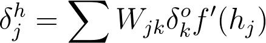

# Things to revisit after the Udacity DL Nanodegree

## Lesson 2

Why do we use the outer product to get the weights derivative term?

----------

Why is there a sum in the [following](https://classroom.udacity.com/nanodegrees/nd101/parts/94643112-2cab-46f8-a5be-1b6e4fa7a211/modules/89a1ec1d-4c22-4a77-b230-b0da99240c89/lessons/07f472eb-0210-446f-8ec2-d297b06c86d0/concepts/87d85ff2-db15-438b-9be8-d097ea917f1e):

> To update the weights to hidden layers using gradient descent, you need to know how much error each of the hidden units contributed to the final output. Since the output of a layer is determined by the weights between layers, the error resulting from units is scaled by the weights going forward through the network. Since we know the error at the output, we can use the weights to work backwards to hidden layers.

> For example, in the output layer, you have errors  attributed to each output unit . Then, the error attributed to hidden unit  is the output errors, scaled by the weights between the output and hidden layers (and the gradient):

> 

I pretty sure that this should be a sum over , the output units.

Search for Lesson 2 notes implementation line:

```
   hidden_error = np.dot(output_error_term, weights_hidden_output)
```

------

Further learning:

* [Karpathy: Yes you should understand backprop](https://medium.com/@karpathy/yes-you-should-understand-backprop-e2f06eab496b)
* [Karpathy: Backprop from CS231n](https://www.youtube.com/watch?v=59Hbtz7XgjM)

@andreiliphd: Ass 2 and 4:
https://www.youtube.com/watch?v=K165trYeqQo&feature=youtu.be

* [AI, Deep Learning, and Machine Learning: A Primer (Deep learning over the last 50 years)](https://www.youtube.com/watch?v=ht6fLrar91U&feature=youtu.be)

------------

LinkedIn

Here’s what to do:
:one: Add your profile to *LinkedIn Profiles Table* and connect with other phase 2 pyTorchers: https://bit.ly/2FZtATT
:two: Join our *LinkedIn Group*: https://www.linkedin.com/groups/13666024/
:three: Don’t forget to *share your Resume, Elevator Pitch, GitHub profile* in the channel to get a peer review!

